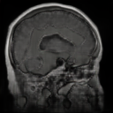

# MedGAN: Medical Image Generation with GANs

MedGAN is a collection of implementations of Generative Adversarial Networks (GANs) designed for generating medical images, with a focus on brain tumor MRI scans. This repository includes state-of-the-art GAN architectures optimized for high-quality, diverse, and stable image generation.


## Implemented GAN Architectures

The repository includes the following GAN architectures:

- **DCGAN (Deep Convolutional GAN):**  
  [Paper](https://arxiv.org/abs/1511.06434)  
  Utilizes convolutional layers to generate high-quality images efficiently.

- **ProGAN (Progressive Growing of GANs):**  
  [Paper](https://arxiv.org/abs/1710.10196)  
  Features progressive training for enhanced stability and image quality.

- **StyleGAN & StyleGAN2:**  
  - **StyleGAN:** [Paper](https://arxiv.org/abs/1812.04948)  
    A style-based generator offering fine-grained control over image features.  
  - **StyleGAN2:** [Paper](https://arxiv.org/abs/1912.04958)  
    Enhances StyleGAN with fewer artifacts and improved image clarity.

- **WGAN (Wasserstein GAN):**  
  [Paper](https://arxiv.org/abs/1701.07875)  
  Improves training stability through the Wasserstein distance metric.

---

## Dataset

This project uses the [Brain Tumor MRI Scans dataset](https://www.kaggle.com/datasets/masoudnickparvar/brain-tumor-mri-dataset/data) available on Kaggle.  
Download the dataset and place it in the `dataset` directory before starting model training.

---

## Getting Started

### 1. Clone the Repository
Clone the repository to your local machine:
```bash
git clone https://github.com/mozaloom/medgan
cd medgan
```

### 2. Install Dependencies
Install the required Python packages using:
```bash
pip install -r requirements.txt
```

### 3. Download the Dataset
Download the [Brain Tumor MRI Scans dataset](https://www.kaggle.com/datasets/masoudnickparvar/brain-tumor-mri-dataset/data) and save it in the `dataset` directory.

### 4. Train a Model
Each GAN architecture has its own training script located in its respective folder (e.g., `ProGAN/`, `StyleGAN2/`).  
Refer to the specific folder for details on training parameters and scripts.

---

## Performance Comparison (temp values)

| **GAN Architecture** | **FID** | **IS**  | **SSIM** | **PSNR (dB)** | **Image Quality** | **Training Stability** | **Generation Diversity** | **Training Time** |
|-----------------------|---------|---------|----------|---------------|-------------------|-------------------------|--------------------------|-------------------|
| **ProGAN**            | 8.4     | 3.5     | 0.87     | 32.1          | High              | Excellent              | High                     | Moderate          |
| **StyleGAN1**         | 6.2     | 4.1     | 0.91     | 33.8          | Very High         | Moderate               | Very High                | High              |
| **StyleGAN2**         | 4.5     | 4.5     | 0.93     | 34.2          | Excellent          | Excellent              | Excellent                | Very High         |
| **WGAN-GP**           | 12.6    | 2.9     | 0.80     | 28.5          | Moderate           | High                   | Moderate                 | Low               |
| **DCGAN**             | 15.3    | 2.5     | 0.75     | 26.9          | Moderate           | Moderate               | Low                      | Very Low          |

---

### Metric Descriptions:
- **FID (Fréchet Inception Distance):** Measures image quality by comparing generated images to real ones; lower is better.  
- **IS (Inception Score):** Evaluates image diversity and quality; higher is better.  
- **SSIM (Structural Similarity Index):** Assesses structural similarity to real images; higher is better.  
- **PSNR (Peak Signal-to-Noise Ratio):** Quantifies image reconstruction quality; higher (in decibels) is better.

---

## Examples of Generated Images

Here’s an example of an image generated using **ProGAN** after 180 epochs (Step 5):



For additional examples, visit the [images directory](images).

---

## Contributing

Contributions to MedGAN are welcome! To contribute:

1. Fork this repository.
2. Create a new branch (`feature/your-feature`).
3. Commit your changes.
4. Submit a pull request.

Feel free to report issues or suggest enhancements via the Issues tab.

---

## License

This project is licensed under the terms specified in the [LICENSE](LICENSE) file.

---

## Contact

For inquiries or collaboration opportunities, please feel free to reach out through the repository's contact channels.

---
```


